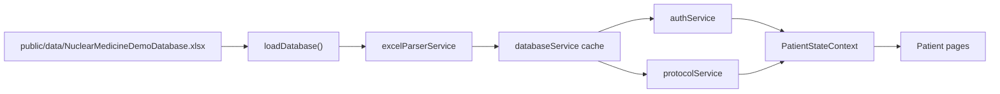

# Nuclear Medicine Guide — Project Status

**Last updated:** June 2026  
**Purpose:** Snapshot of the current codebase. No functionality changes implied by this document.

---

## Overview

Nuclear Medicine Guide is a **client-only** React application for guiding patients through nuclear medicine visit protocols. Data is loaded from a local Excel file at runtime. There is **no backend**, **no external APIs**, and **no hardcoded patient or protocol content**.

| Item | Value |
|------|--------|
| Stack | React 19, TypeScript, Vite 6, React Router 7 |
| Data source | `public/data/NuclearMedicineDemoDatabase.xlsx` |
| State | React Context + `useState` (in-memory) |
| i18n | Hebrew (`he`) and English (`en`) — inline translation map |
| Primary UX | Mobile-first patient journey |
| Secondary UX | Staff dashboard shell (not implemented) |

---

## Current Architecture

### High-level structure

```
┌─────────────────────────────────────────────────────────────┐
│  main.tsx → App → AppProviders → AppRouter                  │
└─────────────────────────────────────────────────────────────┘
                              │
        ┌─────────────────────┴─────────────────────┐
        ▼                                           ▼
  PatientLayout                              StaffLayout
  (mobile-first)                             (desktop shell)
        │                                           │
        ▼                                           ▼
  Patient pages                          (no routes yet)
```

### Layering

| Layer | Location | Responsibility |
|-------|----------|----------------|
| **App shell** | `src/app/` | Root component, providers, route definitions |
| **Features** | `src/features/patient/`, `src/features/staff/` | Domain UI, feature state, feature services |
| **Shared** | `src/shared/` | Models, Excel/data services, layouts, constants |
| **Styles** | `src/styles/` | Global CSS variables and area-specific layout CSS |

### Data flow



1. **Load:** `loadDatabase()` fetches `/data/NuclearMedicineDemoDatabase.xlsx` and parses the workbook.
2. **Cache:** Parsed `patients` and `protocolSteps` are stored in memory (`databaseService`).
3. **Login:** `validatePatientLogin()` matches `idNumber` + `verificationCode` against the Patients sheet.
4. **Session:** `createPatientSession()` attaches protocol steps filtered by `patient.protocolId`.
5. **Journey:** `advanceStep()` updates `currentStepIndex` in context; UI reads journey via `usePatientJourney()`.

### Path alias

- `@/*` → `src/*` (configured in `vite.config.ts` and `tsconfig.app.json`)

### Providers (`src/app/providers.tsx`)

Nested order:

1. `BrowserRouter`
2. `PatientStateProvider` — language, session, journey step index
3. `StaffStateProvider` — placeholder empty state

---

## Existing Data Models

### `Patient` (`src/shared/models/Patient.ts`)

Mapped from the **Patients** Excel sheet.

| Field | Type | Excel column |
|-------|------|----------------|
| `idNumber` | `string` | `idNumber` |
| `verificationCode` | `string` | `verificationCode` |
| `firstName` | `string` | `firstName` |
| `lastName` | `string` | `lastName` |
| `examType` | `string` | `examType` |
| `appointmentTime` | `string` | `appointmentTime` (HH:mm) |
| `protocolId` | `string` | `protocolId` |
| `currentStepIndex` | `number` | `currentStepIndex` |
| `status` | `string` | `status` |
| `notes` | `string \| null` | `notes` |

### `ProtocolStep` (`src/shared/models/ProtocolStep.ts`)

Mapped from the **ProtocolSteps** Excel sheet.

| Field | Type | Excel column |
|-------|------|----------------|
| `protocolId` | `string` | `protocolId` |
| `stepOrder` | `number` | `stepOrder` |
| `stepTitle` | `string` | `stepTitle` |
| `stepType` | `string` | `stepType` |
| `estimatedMinutes` | `number` | `estimatedMinutes` |

### `PatientSession` (`src/features/patient/types/session.ts`)

Runtime session after successful login (not an Excel row).

| Field | Type | Source |
|-------|------|--------|
| `patient` | `Patient` | Patients sheet |
| `protocolSteps` | `ProtocolStep[]` | ProtocolSteps sheet, filtered by `patient.protocolId` |
| `currentStepIndex` | `number` | Initialized from `patient.currentStepIndex`, advanced in app |

### Other types

| Type | Location | Notes |
|------|----------|-------|
| `Language` | `features/patient/types/language.ts` | `'he' \| 'en'` |
| `StaffState` | `features/staff/state/StaffStateContext.tsx` | `Record<string, never>` (placeholder) |
| `UserRole` | `shared/types/index.ts` | `'patient' \| 'staff'` |
| `ParsedDatabase` | `shared/services/excel/excelParserService.ts` | `{ patients, protocolSteps, warnings }` |
| `ParseWarning` | same | Non-fatal parse issues per sheet/row |
| `LoginValidationResult` | `features/patient/services/authService.ts` | Success with session or error code |

### Excel sheets in file vs. app

| Sheet in workbook | Parsed? | Used in app? |
|-------------------|---------|--------------|
| `Patients` | Yes | Yes — login, welcome |
| `ProtocolSteps` | Yes | Yes — journey, current step |
| `StepEducation` | No | No |
| `PreparationChecklists` | No | No |

Parser behavior: **unknown columns are ignored**; **missing fields** get safe defaults; **invalid rows** are skipped with warnings (no crash).

---

## Existing Services

### Data layer (`src/shared/services/data/`)

| Export | File | Description |
|--------|------|-------------|
| `loadDatabase()` | `databaseService.ts` | Fetch Excel, parse, cache |
| `getCachedDatabase()` | | Return cached parse result |
| `getPatients()` | | All patients |
| `getProtocolSteps()` | | All protocol steps |
| `getProtocolStepsByProtocolId()` | | Filtered + sorted by `stepOrder` |
| `getPatientByIdNumber()` | | Lookup with numeric ID fallback |
| `getEstimatedVisitDurationMinutes()` | | Sum of `estimatedMinutes` for a protocol |
| `clearDatabaseCache()` | | Reset cache |

**Database URL:** `getDatabaseUrl()` → `/data/NuclearMedicineDemoDatabase.xlsx` (from `public/data/`).

### Excel parser (`src/shared/services/excel/`)

| Export | File | Description |
|--------|------|-------------|
| `parseWorkbook()` | `excelParserService.ts` | Parse full workbook to `ParsedDatabase` |
| `parsePatientsSheet()` | | Patients sheet only |
| `parseProtocolStepsSheet()` | | ProtocolSteps sheet only |
| Column aliases | `columnMappings.ts` | Known header → field mapping |
| Parse helpers | `parseUtils.ts` | Safe string/number/time coercion |

**Dependency:** `xlsx` (SheetJS).

### Patient feature services (`src/features/patient/services/`)

| Service | Description |
|---------|-------------|
| `authService.ts` | `validatePatientLogin(idNumber, verificationCode)` — Excel-backed credentials |
| `protocolService.ts` | Session creation, step index clamping, remaining minutes, progress %, upcoming steps |

### Utilities (`src/features/patient/utils/`)

| Utility | Description |
|---------|-------------|
| `displayValue.ts` | Safe display for optional/empty strings |
| `formatDuration.ts` | Format minutes as human-readable duration (HE/EN) |

---

## Existing Components

### Shared layouts (`src/shared/components/layout/`)

| Component | Description |
|-----------|-------------|
| `PatientLayout` | Mobile-first shell; max-width main area; renders `<Outlet />` |
| `StaffLayout` | Desktop shell with sidebar + header placeholders; renders `<Outlet />` |

### Shared UI (`src/shared/components/ui/`)

- **Empty** — placeholder barrel file only; no primitives implemented yet.

### Patient feature components (`src/features/patient/components/`)

| Component | Description |
|-----------|-------------|
| `ProtocolStepTracker` | Vertical timeline: completed (checkmark), current (highlighted), upcoming (inactive) |
| `UpcomingStepsSection` | List of future steps with titles and per-step duration from Excel |

### Staff feature components (`src/features/staff/components/`)

- **Empty** — placeholder only.

---

## Existing Pages

All patient pages live under `src/features/patient/pages/` with co-located CSS.

| Page | Route | Status | Description |
|------|-------|--------|-------------|
| **LoginPage** | `/patient/login` | Implemented | Language selector, ID + verification code, Excel load status, sign-in |
| **WelcomePage** | `/patient/welcome` | Implemented | First name, exam type, appointment time; **Start My Journey** |
| **CurrentStepPage** | `/patient/step` | Implemented | Current step UI, progress tracker, remaining time, upcoming steps, complete step |
| **NextStepsPage** | `/patient/next-steps` | Implemented | Standalone upcoming-steps list (route exists; primary UX is inline on Current Step) |
| **CompletionPage** | `/patient/completion` | Implemented | Simple visit-complete message |

### Staff pages (`src/features/staff/pages/`)

- **None implemented** — `StaffLayout` renders an empty `<Outlet />`.

### Default routing

- `/patient` → redirects to `/patient/login`
- `*` → redirects to `/patient/login`

---

## Patient Journey Flow (Implemented)

```
Login → Welcome → Current Step ⟲ (complete step) → Completion
                      ↓
              (optional: /patient/next-steps)
```

| Step | Behavior |
|------|----------|
| Login | Loads Excel; validates credentials; creates `PatientSession` with protocol steps |
| Welcome | Shows patient summary from Excel; starts journey at `currentStepIndex` |
| Current Step | Tracker for all steps; remaining time = sum of current + future `estimatedMinutes`; **I completed this step** advances index |
| Completion | Shown when `currentStepIndex >= protocolSteps.length` |

**Authentication guard:** Welcome, step, next-steps, and completion pages redirect to login if no session.

---

## State Management

### `PatientStateProvider` (`src/features/patient/state/PatientStateContext.tsx`)

| State / API | Description |
|-------------|-------------|
| `language` | `'he'` (default) or `'en'` |
| `session` | `PatientSession \| null` |
| `currentPatient` | Convenience accessor for `session.patient` |
| `login(session)` | Set session after successful login |
| `logout()` | Clear session |
| `advanceStep()` | Increment step index; returns `true` if journey complete |
| `isAuthenticated` | `session !== null` |
| `setLanguage()` | Update UI language |

### `StaffStateProvider` (`src/features/staff/state/StaffStateContext.tsx`)

- Placeholder context with empty `StaffState` and generic `setState`.

---

## Hooks

| Hook | Location | Description |
|------|----------|-------------|
| `usePatientState()` | `features/patient/state` | Session, language, auth actions |
| `usePatientTranslations()` | `features/patient/hooks` | `t(key, params?)` for current language |
| `usePatientJourney()` | `features/patient/hooks` | Derived journey: current step, progress, remaining minutes, upcoming steps |
| `useStaffState()` | `features/staff/state` | Placeholder |

---

## Internationalization

- **File:** `src/features/patient/i18n/translations.ts`
- **Languages:** Hebrew, English
- **RTL:** Applied via `dir="rtl"` on patient pages when language is `he`
- Keys cover login, welcome, journey, completion, and step UI labels

---

## Styling

| File | Scope |
|------|--------|
| `src/styles/variables.css` | Design tokens (colors, spacing, breakpoints) |
| `src/styles/global.css` | Base reset and typography |
| `src/styles/patient.css` | Patient layout shell |
| `src/styles/staff.css` | Staff layout shell (sidebar at ≥1024px) |
| `src/features/patient/pages/*.css` | Page-specific styles |
| `src/features/patient/components/*.css` | Component-specific styles |

---

## Project File Layout (Source)

```
nuclear-medicine-guide/
├── public/
│   ├── data/
│   │   └── NuclearMedicineDemoDatabase.xlsx   # Runtime data source
│   └── favicon.svg
├── scripts/
│   └── verify-excel-parse.mjs                 # Dev script to verify Excel parse
├── src/
│   ├── app/           App, providers, routes
│   ├── assets/
│   ├── features/
│   │   ├── patient/   pages, components, hooks, i18n, services, state, types, utils
│   │   └── staff/     placeholder structure
│   ├── shared/
│   │   ├── components/layout/
│   │   ├── constants/
│   │   ├── models/
│   │   ├── services/  data/, excel/
│   │   └── types/
│   └── styles/
├── package.json
├── vite.config.ts
├── tsconfig*.json
└── README.md
```

---

## Not Yet Implemented

The following were explicitly excluded or remain as scaffolding only:

| Area | Status |
|------|--------|
| Staff dashboard screens | Shell only |
| FAQ | Not started |
| Education content (`StepEducation` sheet) | Not started |
| Preparation checklists (`PreparationChecklists` sheet) | Not started |
| Help requests | Not started |
| Timers / countdown UI | Not started |
| Shared UI component library | Empty placeholder |
| Backend / REST API | Out of scope |
| Persistent storage (localStorage, etc.) | Not used — session lost on refresh |
| Logout UI | `logout()` exists but no button wired |

---

## Scripts & Tooling

| Command | Purpose |
|---------|---------|
| `npm run dev` | Vite dev server |
| `npm run build` | TypeScript check + production build |
| `npm run preview` | Preview production build |
| `npm run lint` | ESLint |
| `node scripts/verify-excel-parse.mjs` | Verify Excel file parses (Node) |

---

## Summary

The application delivers a **complete patient login and protocol journey** driven entirely by **Excel data** from `public/data/NuclearMedicineDemoDatabase.xlsx`. The **patient path** is functional end-to-end: login → welcome → step-by-step protocol navigation → completion. The **staff path** and several content modules (education, FAQ, checklists) are structured in the repo but not built out. All runtime state lives in React Context with no persistence layer.
